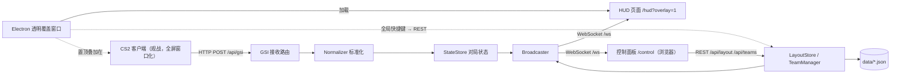

# CS2 导播系统 PRD（GSI + FastAPI + React）

Sep 25, 2026 · @Dennis

## 1. 项目概述

本项目构建一个 CS2 比赛导播工具：CS2 通过 Game State Integration（GSI）把对局数据推送给 Python FastAPI 后端，后端标准化后经 WebSocket 实时推送给两个 React 页面——比赛 HUD 和导播控制面板。HUD 由一个 Electron 桌面程序以全屏、透明、置顶、鼠标穿透的窗口直接覆盖在 CS2 游戏画面上显示，不依赖 OBS。

### 1.1 MVP 功能（P0，必须实现）

| 编号 | 功能 | 说明 |
| --- | --- | --- |
| F1 | GSI 数据接入 | 接收 CS2 POST 的 JSON，校验 token，解析并标准化 |
| F2 | 比分显示 | 双方队名、比分、当前回合数、回合阶段倒计时、炸弹状态 |
| F3 | 选手信息 | 每名选手：名字、血量、护甲/头盔、拆弹器、金钱、K/A/D、当前武器、存活状态 |
| F4 | 当前观察选手 | 大面板显示被观察选手的血量、护甲、K/A/D、武器与弹药 |
| F5 | HUD 整体显隐 | 控制面板一键隐藏/显示整个 HUD，HUD 端即时生效（< 200 ms） |
| F6 | 模块显隐 | 每个 HUD 模块可单独隐藏/显示 |
| F7 | 模块位置调整 | 控制面板在 16:9 预览画布中拖拽模块，并可调整缩放；HUD 实时同步 |
| F8 | 布局持久化 | 布局保存到本地 JSON，重启后恢复；支持一键恢复默认布局 |
| F9 | 队名覆盖与换边 | 控制面板可手动设置队名；中场换边时队伍自动跟随，也可手动交换 |
| F10 | 连接状态 | 控制面板显示 GSI 是否在线、最后更新时间、HUD 客户端连接数 |
| F11 | 桌面透明覆盖窗口 | Electron 程序在指定显示器上创建透明、置顶、鼠标穿透的全屏窗口加载 HUD；全局快捷键切换 HUD 显隐 |

### 1.2 增强功能（P1，MVP 之后）

- 布局预设：保存/加载/删除命名布局。
- 回合历史条：显示每回合胜方与胜利方式（歼灭、拆包、爆炸、时间）。
- 队伍 Logo 上传与显示。
- 原始 GSI 数据调试视图。

### 1.3 非目标

- 不做小地图、击杀信息流（GSI 不提供击杀事件）、自动切换观察视角。
- 不做 OBS 或其他推流软件集成；`/hud` 页面仍可在普通浏览器中打开，仅用于调试。
- 不做多用户权限系统、云端部署、数据库。

## 2. 默认假设与约束

以下假设决定了实现方式，构建方 Agent 必须按此实现：

| 项 | 默认设定 |
| --- | --- |
| 部署形态 | CS2（观战）、后端、HUD 覆盖窗口运行在同一台 Windows 电脑；控制面板可在本机或局域网内另一台设备的浏览器打开 |
| 数据来源视角 | 导播使用 CS2 观战者身份（GOTV、服务器观察位或 `playdemo` 回放），只有这样 GSI 才会下发 `allplayers` 全部 10 名选手数据 |
| 非观战模式 | 若只收到 `player` 而无 `allplayers`，HUD 仍可运行，只显示比分与当前玩家，选手列表模块显示为空 |
| 比赛制式 | 5v5 竞技，MR12（常规 24 回合），加时 MR3；数值可在配置中修改 |
| HUD 输出 | Electron 透明覆盖窗口，铺满 CS2 所在显示器；HUD 内部以 1920×1080 为参考画布等比缩放 |
| CS2 显示模式 | 必须为“全屏窗口化”或“窗口化”；独占全屏模式下任何外部窗口都无法显示在游戏之上 |
| 反作弊 | 覆盖窗口是独立进程，不注入游戏、不读取游戏内存，数据只来自官方 GSI |
| 控制面板访问 | 仅局域网，无登录鉴权 |
| 持久化 | 本地 JSON 文件，不使用数据库 |
| 界面语言 | 控制面板与覆盖窗口托盘菜单为中文；HUD 文字仅显示数据（队名、选手名、数字） |
| 操作系统 | 后端与控制面板跨平台；覆盖窗口以 Windows 10/11 为目标平台，macOS/Linux 只需能启动用于开发 |

约束：GSI 只推送状态快照，不推送事件（例如击杀），因此所有“变化”需由后端对比前后快照推断。

## 3. 系统架构与技术栈

后端是唯一的状态源：GSI 数据和控制面板的修改都进入后端，再由后端广播给所有前端页面。前端页面之间不直接通信。



数据流：CS2 POST → 校验 token → 标准化为 `MatchState` → 与上一帧对比，有变化才广播 → HUD 与控制面板收到后重新渲染。控制面板的修改走 REST，后端落盘后再经 WebSocket 广播，控制面板自身也以广播结果为准。

### 3.1 技术栈

| 层 | 选型 | 版本要求 | 用途 |
| --- | --- | --- | --- |
| 后端语言 | Python | ≥ 3.11 |  |
| Web 框架 | FastAPI | 最新稳定版 | REST + WebSocket |
| ASGI 服务器 | uvicorn\[standard\] | 最新稳定版 | 运行服务，含 websockets |
| 数据校验 | Pydantic v2、pydantic-settings | v2.x | 模型与 `.env` 配置 |
| 后端测试 | pytest、httpx | 最新稳定版 | 单元与接口测试 |
| 前端语言 | TypeScript | ≥ 5 |  |
| 前端框架 | React | 18 |  |
| 构建工具 | Vite | ≥ 5 | 开发服务器与打包 |
| 路由 | react-router-dom | 6 | `/hud` 与 `/control` 两个页面 |
| 状态管理 | Zustand | 4 | 保存 WebSocket 推送的状态 |
| 拖拽缩放 | react-rnd | 最新稳定版 | 控制面板布局编辑 |
| 样式 | Tailwind CSS | 3 | 控制面板；HUD 可用 Tailwind 或 CSS Modules |
| 前端测试 | Vitest | 最新稳定版 | 坐标换算等纯函数 |
| 覆盖窗口 | Electron（TypeScript） | ≥ 30 | 透明、置顶、鼠标穿透窗口，托盘与全局快捷键 |
| 覆盖窗口打包 | electron-builder | 最新稳定版 | 生成 Windows 便携版 exe |
| 运行环境 | Node.js | 20 LTS | 构建前端与覆盖窗口时需要；覆盖窗口打包后运行无需 Node |

运行时共两个进程：Python 进程（FastAPI，同时托管 `frontend/dist` 静态文件，默认端口 `8000`）和 Electron 覆盖窗口进程（加载 `http://127.0.0.1:8000/hud?overlay=1`）。覆盖窗口不含业务逻辑，只是 HUD 页面的透明容器。

## 4. CS2 GSI 接入规范

CS2 启动时读取 `game/csgo/cfg/` 下所有 `gamestate_integration_*.cfg` 文件，并按其中的 `uri` 持续 POST JSON。项目需在仓库 `cfg/` 目录提供以下文件，用户手动复制到 `...\steamapps\common\Counter-Strike Global Offensive\game\csgo\cfg\` 后重启 CS2。

### 4.1 配置文件 `cfg/gamestate_integration_cs2broadcast.cfg`

```
"CS2 Broadcast HUD"
{
  "uri"       "http://127.0.0.1:8000/api/gsi"
  "timeout"   "1.1"
  "buffer"    "0.1"
  "throttle"  "0.1"
  "heartbeat" "10.0"
  "auth"
  {
    "token"   "CHANGE_ME_TOKEN"
  }
  "data"
  {
    "provider"               "1"
    "map"                    "1"
    "map_round_wins"         "1"
    "round"                  "1"
    "phase_countdowns"       "1"
    "bomb"                   "1"
    "player_id"              "1"
    "player_state"           "1"
    "player_weapons"         "1"
    "player_match_stats"     "1"
    "player_position"        "1"
    "allplayers_id"          "1"
    "allplayers_state"       "1"
    "allplayers_match_stats" "1"
    "allplayers_weapons"     "1"
    "allplayers_position"    "1"
  }
}
```

后端 `.env` 中的 `GSI_TOKEN` 必须与 `auth.token` 一致。后端启动时若 `GSI_TOKEN` 仍为默认值，打印警告。

### 4.2 接收规则

1. 路由 `POST /api/gsi`，请求体为 JSON，可能缺少任意顶层字段，所有解析必须容错（字段缺失时用默认值或 `null`，不得抛 500）。
2. 校验 `body.auth.token == GSI_TOKEN`；不一致返回 `401` 并忽略数据。
3. 无论解析是否成功，只要 token 正确都返回 `200` 空响应体，避免 CS2 重试堆积。
4. 忽略 `previously` 和 `added` 字段，只使用当前快照。
5. 记录 `last_gsi_at`（服务器单调时间）；超过 `GSI_OFFLINE_SECONDS`（默认 15 秒）未收到数据，将 `gsi_online` 置为 `false` 并广播 `gsi_status`。
6. 保存最近一次原始 payload 到内存，供 `GET /api/debug/raw` 调试。

### 4.3 原始字段（需解析的部分）

| 路径 | 类型 | 含义 |
| --- | --- | --- |
| `provider.timestamp` | int | 游戏端时间戳 |
| `map.name` / `map.mode` | str | 地图名（如 `de_mirage`）/ 模式 |
| `map.phase` | str | `warmup` / `live` / `intermission` / `gameover` |
| `map.round` | int | 已完成回合数（从 0 开始），当前回合 = 该值 + 1 |
| `map.team_ct` / `map.team_t` | object | `score`、`name`（可能缺失）、`timeouts_remaining`、`consecutive_round_losses`、`matches_won_this_series` |
| `map.round_wins` | object | 键为回合序号字符串，值如 `ct_win_elimination`、`t_win_bomb`、`ct_win_defuse`、`ct_win_time` |
| `round.phase` | str | `freezetime` / `live` / `over` |
| `round.bomb` | str | `planted` / `exploded` / `defused`（可能缺失） |
| `round.win_team` | str | `CT` / `T`（回合结束时） |
| `phase_countdowns.phase` | str | `freezetime` / `live` / `bomb` / `defuse` / `over` / `warmup` / `timeout_ct` / `timeout_t` 等 |
| `phase_countdowns.phase_ends_in` | str | 剩余秒数，字符串形式的小数 |
| `bomb.state` | str | `carried` / `dropped` / `planted` / `planting` / `defusing` / `defused` / `exploded` |
| `bomb.countdown` | str | 炸弹或拆弹倒计时（可能缺失） |
| `bomb.player` | str | 携带或拆弹者 steamid（可能缺失） |
| `player` | object | 当前观察或本人玩家，结构同 `allplayers` 中单个选手，额外含 `steamid` |
| `allplayers.<steamid>` | object | `name`、`observer_slot`、`team`、`state`、`match_stats`、`weapons`、`position` |
| `.state` | object | `health`、`armor`、`helmet`、`defusekit`、`flashed`、`smoked`、`burning`、`money`、`round_kills`、`round_killhs`、`equip_value` |
| `.match_stats` | object | `kills`、`assists`、`deaths`、`mvps`、`score` |
| `.weapons.weapon_N` | object | `name`（如 `weapon_ak47`）、`type`（`Rifle`、`Pistol`、`Grenade`、`Knife`、`C4` 等）、`state`（`active` / `holstered`）、`ammo_clip`、`ammo_clip_max`、`ammo_reserve` |

字段可能以字符串形式给出数字（例如倒计时），标准化时统一转换类型。

## 5. 标准化数据模型

前端只消费以下标准化模型，不直接读取 GSI 原始字段。后端用 Pydantic v2 定义，前端在 `src/lib/types.ts` 定义同名 TypeScript 类型，字段名统一 `snake_case`。

### 5.1 MatchState（对局状态）

```python
class MatchState(BaseModel):
    gsi_online: bool
    last_update_ms: int | None          # 服务器收到最后一帧的 Unix 毫秒
    has_allplayers: bool                # 是否处于观战模式
    map: MapInfo
    round: RoundInfo
    teams: TeamsView                    # 按 HUD 左/右组织，已合并队名覆盖
    players: list[Player]               # 最多 10 人，按 observer_slot 升序
    observed_steamid: str | None        # 当前观察选手
    bomb: BombInfo
    round_history: list[RoundResult]

class MapInfo(BaseModel):
    name: str | None                    # de_mirage
    display_name: str | None            # Mirage（去掉 de_ 前缀并首字母大写）
    mode: str | None
    phase: Literal["warmup","live","intermission","gameover","unknown"]
    current_round: int                  # map.round + 1

class RoundInfo(BaseModel):
    phase: Literal["freezetime","live","over","unknown"]
    countdown_phase: str | None         # phase_countdowns.phase
    phase_ends_in: float | None         # 秒
    win_side: Literal["CT","T"] | None

class BombInfo(BaseModel):
    state: Literal["carried","dropped","planting","planted","defusing","defused","exploded","none"]
    countdown: float | None
    player_steamid: str | None

class RoundResult(BaseModel):
    round: int                          # 1 起
    winner_side: Literal["CT","T"]
    reason: Literal["elimination","bomb","defuse","time","unknown"]
```

### 5.2 队伍与左右视图

```python
class TeamView(BaseModel):
    slot: Literal["A","B"]              # 队伍身份，不随换边改变
    side: Literal["CT","T"]             # 当前阵营
    name: str                           # 覆盖名 > GSI 名 > "CT"/"T"
    short_name: str | None
    score: int
    timeouts_remaining: int | None
    consecutive_round_losses: int | None
    series_wins: int | None
    alive_count: int

class TeamsView(BaseModel):
    left: TeamView
    right: TeamView
```

### 5.3 Player（选手）

```python
class Weapon(BaseModel):
    name: str                           # weapon_ak47
    display_name: str                   # AK-47（见映射表）
    type: str | None                    # Rifle / Pistol / Grenade / Knife / C4 ...
    active: bool
    ammo_clip: int | None
    ammo_clip_max: int | None
    ammo_reserve: int | None

class Player(BaseModel):
    steamid: str
    name: str
    observer_slot: int | None           # 观战键位 0-9，HUD 显示为 1-9、0
    side: Literal["CT","T"] | None
    team_slot: Literal["A","B"] | None
    health: int
    armor: int
    helmet: bool
    defusekit: bool
    money: int
    equip_value: int
    round_kills: int
    round_killhs: int
    flashed: int                        # 0-255
    burning: int                        # 0-255
    kills: int
    assists: int
    deaths: int
    mvps: int
    score: int
    is_alive: bool                      # health > 0
    is_observed: bool
    has_bomb: bool                      # 武器中含 C4
    active_weapon: Weapon | None
    primary: Weapon | None              # Rifle/SniperRifle/SMG/Shotgun/Machine Gun
    secondary: Weapon | None            # Pistol
    grenades: list[str]                 # display_name 列表
```

武器显示名映射放在 `backend/app/core/weapons.py`，至少覆盖所有现役步枪、狙击、冲锋枪、霰弹、机枪、手枪、投掷物、刀和 C4；未命中映射时去掉 `weapon_` 前缀后原样显示。

### 5.4 队伍身份与自动换边

队伍用固定身份 A/B 表示，避免中场换边时队名错位：

1. 首次收到 `map.phase == live` 且含 `allplayers` 时，把当前 CT 方选手的 steamid 集合记为 A 队名单，T 方记为 B 队名单，A 初始为 CT。
2. 之后每帧统计 A 队名单中处于 CT 与 T 的人数；若多数（≥ 3 人）在 T，则判定 A 已换到 T，更新 `a_side`。
3. 名单中出现新 steamid 时并入其当前所在一方的名单（处理换人）。
4. 无 `allplayers` 时不做自动判定，只能手动交换。
5. 控制面板可随时 `POST /api/teams/swap` 手动翻转，并可 `POST /api/teams/reset-roster` 清空名单重新学习。

HUD 左右位置由 `TeamSettings.left_slot` 决定（默认 A 在左），因此换边时队伍不会在屏幕上左右跳动，只有阵营颜色变化。

### 5.5 布局模型

```python
class ModuleLayout(BaseModel):
    id: str                             # 模块 ID，见第 8 节
    visible: bool = True
    x: float                            # 1920×1080 参考画布中的像素坐标，模块左上角
    y: float
    scale: float = 1.0                  # 0.25 - 3.0
    z: int = 0                          # 叠放顺序

class HudLayout(BaseModel):
    version: int = 1
    hud_visible: bool = True            # HUD 整体显隐
    modules: dict[str, ModuleLayout]
    updated_at_ms: int

class TeamSettings(BaseModel):
    a_name: str | None = None           # 覆盖队名，None 表示使用 GSI 名
    b_name: str | None = None
    a_short: str | None = None
    b_short: str | None = None
    a_side: Literal["CT","T"] = "CT"
    left_slot: Literal["A","B"] = "A"
    auto_swap: bool = True
```

持久化文件：`data/layout.json`（HudLayout）、`data/teams.json`（TeamSettings，不含名单）、`data/presets/<name>.json`（P1）。写入采用先写临时文件再原子替换。

## 6. REST 接口协议

所有接口前缀 `/api`，请求与响应均为 `application/json`，UTF-8。控制面板的所有写操作都走 REST；每次写成功后，后端通过 WebSocket 向全部客户端广播最新数据。

### 6.1 接口列表

| 方法 | 路径 | 请求体 | 成功响应 | 说明 |
| --- | --- | --- | --- | --- |
| POST | `/api/gsi` | GSI 原始 JSON | `200` 空 | CS2 专用；token 错误返回 `401` |
| GET | `/api/health` | - | `{"status":"ok","gsi_online":bool,"ws_clients":{"hud":int,"control":int}}` | 健康检查 |
| GET | `/api/state` | - | `MatchState` | 当前对局状态 |
| GET | `/api/layout` | - | `HudLayout` | 当前布局 |
| PUT | `/api/layout` | `HudLayout` | `HudLayout` | 整体替换布局 |
| PATCH | `/api/layout/modules/{module_id}` | `ModuleLayout` 的部分字段 | `HudLayout` | 更新单个模块的 visible/x/y/scale/z |
| POST | `/api/layout/visibility` | `{"hud_visible":bool}` | `HudLayout` | HUD 整体显隐 |
| POST | `/api/layout/reset` | - | `HudLayout` | 恢复默认布局 |
| GET | `/api/teams` | - | `TeamSettings` | 队伍设置 |
| PUT | `/api/teams` | `TeamSettings` 的部分字段 | `TeamSettings` | 修改队名、左侧队伍、自动换边开关 |
| POST | `/api/teams/swap` | - | `TeamSettings` | 手动翻转 A/B 阵营 |
| POST | `/api/teams/reset-roster` | - | `TeamSettings` | 清空已学习的 A/B 名单 |
| GET | `/api/debug/raw` | - | 最近一帧原始 GSI JSON 或 `null` | 调试 |
| GET | `/api/presets` | - | `{"presets":[str]}` | P1：预设列表 |
| POST | `/api/presets/{name}` | - | `{"name":str}` | P1：把当前布局存为预设 |
| POST | `/api/presets/{name}/apply` | - | `HudLayout` | P1：应用预设 |
| DELETE | `/api/presets/{name}` | - | `204` | P1：删除预设 |

### 6.2 校验与错误

- `module_id` 不存在返回 `404`。
- 坐标限制：`x` 在 `[-500, 2420]`、`y` 在 `[-500, 1580]`，`scale` 在 `[0.25, 3.0]`，越界返回 `422`（前端拖拽时先行夹取）。
- 预设名只允许 `[A-Za-z0-9_-]`，长度 1-32。
- 错误响应统一格式：`{"error":{"code":"MODULE_NOT_FOUND","message":"..."}}`，错误码至少包括 `UNAUTHORIZED`、`MODULE_NOT_FOUND`、`VALIDATION_ERROR`、`PRESET_NOT_FOUND`。

### 6.3 示例

```http
PATCH /api/layout/modules/scoreboard
Content-Type: application/json

{"x": 660, "y": 12, "scale": 1.1}
```

```json
{
  "version": 1,
  "hud_visible": true,
  "updated_at_ms": 1790000000000,
  "modules": {
    "scoreboard": {"id": "scoreboard", "visible": true, "x": 660, "y": 12, "scale": 1.1, "z": 10}
  }
}
```

CORS：开发时允许 `http://localhost:5173`；生产由同源托管，无需 CORS。

## 7. WebSocket 实时协议

WebSocket 只负责服务器向客户端推送，客户端除心跳外不通过 WebSocket 发命令。每次推送完整对象而非差量，单帧通常小于 20 KB，局域网内足够。

### 7.1 连接

- 地址：`ws://<host>:8000/ws?role=hud` 或 `?role=control`；`role` 缺失按 `hud` 处理，仅用于统计连接数。
- 连接建立后服务器立即发送一条 `snapshot`。
- 客户端断线后按 1s、2s、4s、最长 5s 的间隔自动重连，重连成功后以新 `snapshot` 覆盖本地状态。

### 7.2 消息信封

```json
{ "type": "state", "seq": 1024, "ts": 1790000000123, "payload": { } }
```

`seq` 为服务器全局递增序号，客户端丢弃 `seq` 小于已处理值的消息。`ts` 为服务器 Unix 毫秒。

### 7.3 服务器 → 客户端

| type | payload | 触发时机 |
| --- | --- | --- |
| `snapshot` | `{"state":MatchState,"layout":HudLayout,"teams":TeamSettings}` | 连接建立时 |
| `state` | `MatchState` | GSI 数据标准化后与上一次不同；最高 20 次/秒，超出时合并只发最新 |
| `layout` | `HudLayout` | 布局任何修改后，立即发送，不节流 |
| `teams` | `TeamSettings` | 队伍设置修改或自动换边后 |
| `gsi_status` | `{"online":bool,"last_update_ms":int\|null}` | 在线状态变化时 |
| `pong` | `{}` | 收到 `ping` 时 |

### 7.4 客户端 → 服务器

| type | payload | 说明 |
| --- | --- | --- |
| `ping` | `{}` | 每 10 秒一次；30 秒内未收到 `pong` 则主动重连 |

### 7.5 实现要求

- 后端 `Broadcaster` 维护连接集合，发送失败的连接直接移除，不得阻塞其他连接。
- `state` 节流用 asyncio 任务实现：收到新状态时标记 dirty，每 50 ms 检查一次并发送最新值。
- 对比“是否变化”时排除 `last_update_ms` 字段，避免心跳帧触发无意义推送。
- 拖拽过程中控制面板以不超过 30 次/秒的频率调用 `PATCH`，拖拽结束再发送一次最终值，保证覆盖窗口中的 HUD 实时跟随。

## 8. HUD 前端需求（路由 `/hud`）

HUD 是纯展示页面，没有任何交互控件，所有显示内容由 WebSocket 数据驱动。

### 8.1 渲染框架

- 页面 `html`、`body` 背景透明，无滚动条，无边距。
- 根容器固定为 1920×1080，缩放系数 `s = min(窗口宽 / 1920, 窗口高 / 1080)`，用 `transform: scale(s)` 适配并在窗口内水平、垂直居中；非 16:9 显示器四周留透明边。窗口尺寸变化时重算。
- 每个模块是根容器下的绝对定位元素：`left = x`、`top = y`、`transform: scale(scale)`、`transform-origin: top left`、`z-index = z`。
- `hud_visible == false` 时根容器 `opacity: 0`，过渡 300 ms；模块 `visible == false` 时该模块同样淡出。
- URL 带 `?overlay=1` 时为覆盖窗口模式：全局 `pointer-events: none`、禁止文字选择；GSI 离线超过 `GSI_OFFLINE_SECONDS` 或 WebSocket 断开时 HUD 自动整体淡出，避免在桌面上残留静态面板，恢复后自动淡入。
- 非覆盖模式（浏览器调试）下，GSI 离线或尚无数据时模块显示占位样式（队名“—”、比分 0），不报错、不白屏。
- HUD 与控制面板预览使用同一套模块组件（`src/hud/modules/`），保证所见即所得。

### 8.2 模块清单与默认布局

坐标基于 1920×1080 参考画布，尺寸为 scale = 1 时的设计尺寸。

| 模块 ID | 名称 | 默认 x, y | 设计尺寸 | 默认可见 | 优先级 |
| --- | --- | --- | --- | --- | --- |
| `scoreboard` | 顶部比分条 | 660, 0 | 600×90 | 是 | P0 |
| `team_left` | 左侧队伍选手列表 | 0, 680 | 420×380 | 是 | P0 |
| `team_right` | 右侧队伍选手列表 | 1500, 680 | 420×380 | 是 | P0 |
| `observed_player` | 当前观察选手面板 | 680, 950 | 560×110 | 是 | P0 |
| `round_history` | 回合历史条 | 560, 96 | 800×36 | 否 | P1 |

默认布局定义在后端 `app/core/default_layout.py`，前端不硬编码坐标。

### 8.3 模块内容

**scoreboard**：左队名（左队阵营色底）、左队比分、中间区域、右队比分、右队名。中间区域显示：

- 常规：回合倒计时 `m:ss`，下方小字“第 N 回合”。
- `freezetime`：倒计时 + “准备阶段”。
- 炸弹已安放：倒计时区域变红，显示炸弹倒计时；拆弹中显示拆弹倒计时。
- `round.phase == over`：显示“CT 获胜”或“T 获胜”（用胜方队名）。
- 暂停（`timeout_ct` / `timeout_t`）：显示“战术暂停”+ 队名。
- `map.phase == warmup`：显示“热身”。

倒计时在两帧 GSI 之间用本地时钟平滑递减（每 100 ms 刷新），收到新数据后校正。

**team\_left / team\_right**：纵向 5 张选手卡，按 `observer_slot` 升序，高度约 72 px。每张卡包含：

- 观战键位号（`observer_slot` 转换：0-8 显示为 1-9，9 显示为 0）。
- 选手名（超长省略号）。
- 血量条：宽度与血量成正比，阵营色；血量 ≤ 20 变红；右侧显示数字血量。
- 护甲图标（有头盔与无头盔两种状态）、拆弹器图标（仅 CT）、C4 图标（持包者）。
- 金钱 `$4750`，本回合击杀数（> 0 时显示）。
- K / A / D。
- 主武器名（无主武器时显示副武器名）。
- 死亡：整卡降为 50% 不透明度并灰度，血量条清空。
- 被观察：卡片外框高亮。
- 被闪白（`flashed > 0`）：选手名上叠加白色遮罩，不透明度 = flashed / 255。

左侧卡片信息从左向右排列，右侧卡片镜像排列。

**observed\_player**：被观察选手的名字、阵营色条、大号血量与护甲数字、K / A / D、MVP 数、当前武器名与弹药 `clip / reserve`、投掷物列表、金钱。无观察选手时整个模块隐藏。

**round\_history（P1）**：按回合依次排列小方块，颜色为胜方阵营色，图标区分四种胜利方式，中场位置有分隔线。

### 8.4 视觉规范

| Token | 值 |
| --- | --- |
| CT 阵营色 | `#5D79AE` |
| T 阵营色 | `#DE9B35` |
| 面板底色 | `rgba(12, 14, 20, 0.85)` |
| 主文字 | `#FFFFFF` |
| 次文字 | `#A0A6B4` |
| 低血量 | `#E5484D` |
| 字体 | Google Fonts `Rajdhani`（数字与英文）+ 系统中文字体回退 |

图标全部使用自绘 SVG，不使用游戏内的图标素材或商标资源；武器以文字名称显示。

### 8.5 桌面透明覆盖窗口（Electron）

覆盖窗口是仓库 `overlay/` 下的独立 Electron 程序，只负责创建透明窗口并加载 HUD 页面，所有数据与布局仍来自后端。

窗口创建要求（主进程，TypeScript）：

```ts
const d = pickDisplay(config.display_id);          // 找不到则用 screen.getPrimaryDisplay()
const win = new BrowserWindow({
  ...d.bounds,                                     // x, y, width, height 铺满目标显示器
  transparent: true,
  backgroundColor: '#00000000',
  frame: false,
  resizable: false,
  movable: false,
  focusable: false,                                // 不抢游戏焦点
  skipTaskbar: true,
  hasShadow: false,
  fullscreenable: false,
  alwaysOnTop: true,
  webPreferences: { contextIsolation: true, nodeIntegration: false, backgroundThrottling: false },
});
win.setAlwaysOnTop(true, 'screen-saver');
win.setIgnoreMouseEvents(true, { forward: true });  // 鼠标点击穿透到游戏
win.setVisibleOnAllWorkspaces(true);
win.loadURL(`${config.backend_url}/hud?overlay=1`);
```

行为要求：

1. 配置文件 `%APPDATA%/cs2-broadcast-overlay/config.json`，首次启动自动生成，字段：`backend_url`（默认 `http://127.0.0.1:8000`）、`display_id`（默认主显示器）、`hotkeys`、`disable_gpu`（默认 `false`）。开发时环境变量 `OVERLAY_URL` 可覆盖加载地址（如 `http://localhost:5173/hud?overlay=1`）。
2. 系统托盘菜单（中文）：选择显示器（列出 `screen.getAllDisplays()`，显示分辨率与编号，选择后立即移动窗口并写入配置）、显示/隐藏 HUD、重新加载 HUD、打开控制面板（系统默认浏览器打开 `/control`）、退出。
3. 全局快捷键（`globalShortcut`，游戏在前台时也生效，可在配置中修改）：
   - `Ctrl+Shift+H`：切换 HUD 整体显隐——先 `GET /api/layout` 取当前值，再 `POST /api/layout/visibility` 取反，使所有页面同步。
   - `Ctrl+Shift+R`：重新加载 HUD 页面。
   - 快捷键注册失败（被占用）时托盘弹出通知。
4. 置顶保持：每 2 秒重新调用一次 `setAlwaysOnTop(true, 'screen-saver')` 并 `moveTop()`，防止 CS2 获得焦点后覆盖窗口被压到下层。
5. 显示器变化：监听 `screen` 的 `display-metrics-changed`、`display-added`、`display-removed`，重新计算窗口 bounds；目标显示器消失时回落到主显示器。
6. 后端不可达（`did-fail-load`）时每 3 秒重试 `loadURL`，期间窗口保持完全透明，托盘图标提示“未连接”。
7. `disable_gpu: true` 时在 `app.ready` 前调用 `app.disableHardwareAcceleration()`，用于个别显卡上透明窗口出现黑底的情况。
8. 单实例运行（`app.requestSingleInstanceLock()`），重复启动时直接退出。
9. 打包：`electron-builder` 生成 Windows 便携版 `CS2BroadcastOverlay.exe`，不需要安装。

注意：CS2 必须设置为“全屏窗口化”或“窗口化”，否则覆盖窗口无法显示在游戏之上。README 需在显眼位置说明。

## 9. 控制面板需求（路由 `/control`）

控制面板是导播在第二块屏幕上操作的页面，桌面浏览器使用，最小宽度 1280 px。

### 9.1 页面布局

```
┌───────────────────────────────────────────────────────────────┐
│ 顶栏：GSI 在线状态灯 · 最后更新 · 地图/回合 · HUD 连接数 · [HUD 显示/隐藏] │
├──────────────┬────────────────────────────────────────────────┤
│ 左栏         │ 中间：16:9 布局预览画布                          │
│ · 模块列表   │ （实时渲染 HUD 模块，可拖拽/缩放）              │
│ · 队伍设置   │                                                │
│ · 预设(P1)   ├────────────────────────────────────────────────┤
│              │ 底部：选中模块属性（x / y / scale / z / 可见）   │
└──────────────┴────────────────────────────────────────────────┘
```

### 9.2 功能明细

**HUD 整体显隐**：顶栏大按钮，当前可见时显示“隐藏 HUD”（红），隐藏时显示“显示 HUD”（绿）。快捷键 `H`（焦点不在输入框时）。调用 `POST /api/layout/visibility`。

**模块列表**：每个模块一行，包含名称、可见开关、“选中”点击区域。开关调用 `PATCH /api/layout/modules/{id}` 修改 `visible`。

**布局预览画布**：

- 画布按容器宽度等比显示 1920×1080 参考画布，背景为深色棋盘格，可选切换为一张用户上传的游戏截图作为参考背景（仅存在前端内存中，不上传）。
- 画布内渲染与 HUD 相同的模块组件，使用实时对局数据；无数据时用内置示例数据渲染，以便赛前布置。
- 使用 react-rnd 实现拖拽和等比缩放（拖动右下角手柄改变 `scale`，不改变宽高比）。
- 屏幕坐标与参考坐标换算：`ref = screen / previewScale`，写成纯函数并有单元测试。
- 吸附：拖动时距画布边缘或中线 10 个参考像素以内自动吸附，按住 `Alt` 临时关闭吸附。
- 隐藏的模块在画布中以 30% 不透明度和虚线框显示，仍可编辑位置。
- 选中模块后方向键微调 1 px，`Shift` + 方向键 10 px。
- 拖拽中节流调用 PATCH（第 7.5 节），松手后发送最终值。

**属性面板**：显示并可直接输入选中模块的 x、y、scale、z、visible，失焦或回车时提交。提供“恢复默认布局”按钮（二次确认）。

**队伍设置**：

- A 队、B 队的覆盖队名与简称输入框，留空表示使用 GSI 队名。
- 显示 A、B 当前阵营与已学习的名单人数。
- “交换阵营”按钮 → `POST /api/teams/swap`。
- “左侧显示 A/B”切换 → `PUT /api/teams`。
- “自动换边”开关、“重新学习名单”按钮。

**状态与反馈**：

- WebSocket 断开时顶栏显示红色“与服务器断开，正在重连”，所有操作按钮禁用。
- REST 请求失败时右下角 toast 显示错误信息。
- 控制面板的状态只以服务器广播为准：发起修改后可乐观更新，但收到 `layout` 消息后以服务器数据覆盖。

**预设（P1）**：输入名称保存当前布局，列表中可应用或删除。

### 9.3 多窗口一致性

可以同时打开多个控制面板或多个 HUD；任一控制面板的修改在 200 ms 内同步到所有其他页面。

## 10. 目录结构、配置与运行

### 10.1 目录结构

```
cs2-broadcast/
├── README.md                    # 安装、配置 GSI、CS2 显示模式、启动覆盖窗口步骤
├── cfg/
│   └── gamestate_integration_cs2broadcast.cfg
├── backend/
│   ├── pyproject.toml           # 或 requirements.txt + requirements-dev.txt
│   ├── .env.example
│   ├── app/
│   │   ├── main.py              # 创建 app，挂载路由、WS、静态文件、生命周期任务
│   │   ├── config.py            # pydantic-settings
│   │   ├── api/
│   │   │   ├── gsi.py
│   │   │   ├── state.py
│   │   │   ├── layout.py
│   │   │   ├── teams.py
│   │   │   ├── presets.py       # P1
│   │   │   ├── debug.py
│   │   │   └── ws.py
│   │   ├── core/
│   │   │   ├── normalizer.py    # 原始 GSI → MatchState，纯函数
│   │   │   ├── state_store.py   # 当前状态、在线检测
│   │   │   ├── team_manager.py  # A/B 名单与自动换边
│   │   │   ├── layout_store.py  # 布局读写与原子落盘
│   │   │   ├── broadcaster.py   # WS 连接管理与节流
│   │   │   ├── default_layout.py
│   │   │   └── weapons.py       # 武器显示名映射
│   │   └── models/
│   │       ├── gsi_raw.py       # 原始 payload 的宽松模型（extra="allow"）
│   │       ├── match.py
│   │       ├── layout.py
│   │       └── teams.py
│   ├── data/                    # 运行时生成，加入 .gitignore
│   ├── tools/
│   │   └── gsi_simulator.py
│   └── tests/
│       ├── fixtures/            # 各场景 GSI JSON 样本
│       ├── test_normalizer.py
│       ├── test_team_manager.py
│       ├── test_api.py
│       └── test_ws.py
├── frontend/
│   ├── package.json
│   ├── vite.config.ts           # 开发代理 /api 与 /ws 到 8000
│   ├── index.html
│   └── src/
│       ├── main.tsx
│       ├── App.tsx              # 路由 /hud、/control，/ 重定向到 /control
│       ├── lib/
│       │   ├── types.ts         # 与后端模型一一对应
│       │   ├── ws.ts            # 连接、重连、心跳、seq 过滤
│       │   ├── api.ts           # REST 封装
│       │   ├── store.ts         # Zustand
│       │   ├── coords.ts        # 坐标换算与吸附，纯函数
│       │   └── sampleData.ts    # 无数据时的示例 MatchState
│       ├── hud/
│       │   ├── HudPage.tsx      # 读取 ?overlay=1
│       │   ├── HudCanvas.tsx    # 1920×1080 根容器 + 等比缩放居中 + 模块定位
│       │   └── modules/
│       │       ├── registry.ts  # 模块 ID → 组件
│       │       ├── Scoreboard.tsx
│       │       ├── TeamPanel.tsx
│       │       ├── PlayerCard.tsx
│       │       ├── ObservedPlayer.tsx
│       │       └── RoundHistory.tsx   # P1
│       └── control/
│           ├── ControlPage.tsx
│           ├── TopBar.tsx
│           ├── ModuleList.tsx
│           ├── LayoutEditor.tsx
│           ├── PropertyPanel.tsx
│           ├── TeamSettings.tsx
│           └── Presets.tsx       # P1
├── overlay/
│   ├── package.json             # electron、electron-builder、typescript
│   ├── tsconfig.json
│   ├── electron-builder.yml     # Windows portable 目标
│   ├── src/
│   │   ├── main.ts              # 窗口创建、置顶保持、显示器变化、重试加载
│   │   ├── config.ts            # 读写 %APPDATA% 下的 config.json
│   │   ├── tray.ts              # 托盘菜单
│   │   ├── hotkeys.ts           # 全局快捷键与后端 REST 调用
│   │   └── displays.ts          # 显示器选择与 bounds 计算，纯函数
│   └── assets/
│       └── tray-icon.png        # 自绘图标
└── scripts/
    ├── dev.ps1 / dev.sh          # 同时启动后端、Vite 与覆盖窗口（OVERLAY_URL 指向 5173）
    └── build.ps1 / build.sh      # 构建前端、打包覆盖窗口
```

### 10.2 配置项（`backend/.env`）

| 变量 | 默认值 | 说明 |
| --- | --- | --- |
| `HOST` | `0.0.0.0` | 监听地址，允许局域网访问 |
| `PORT` | `8000` | 端口，需与 cfg 中 uri 一致 |
| `GSI_TOKEN` | `CHANGE_ME_TOKEN` | 与 cfg 中 token 一致；为默认值时启动打印警告 |
| `GSI_OFFLINE_SECONDS` | `15` | 判定离线的秒数 |
| `DATA_DIR` | `./data` | 布局、队伍设置、预设存放目录 |
| `FRONTEND_DIST` | `../frontend/dist` | 生产静态文件目录；不存在时只提供 API |
| `STATE_MAX_HZ` | `20` | `state` 推送最高频率 |

### 10.3 运行方式

开发：

```bash
cd backend && pip install -e ".[dev]" && uvicorn app.main:app --reload --host 0.0.0.0 --port 8000
cd frontend && npm install && npm run dev      # http://localhost:5173/control
```

生产：

```bash
cd frontend && npm run build
cd backend && python -m app.main              # http://<ip>:8000/control 与 /hud
```

覆盖窗口：

```bash
cd overlay && npm install && npm run dev       # 开发，按 OVERLAY_URL 或 backend_url 加载 HUD
cd overlay && npm run dist                     # 打包 overlay/release/CS2BroadcastOverlay.exe
```

静态托管要求：`/hud`、`/control` 等非 `/api`、`/ws` 路径全部返回 `index.html`（SPA 回退）。

使用流程：把 CS2 视频设置改为“全屏窗口化”→ 启动后端 → 启动 `CS2BroadcastOverlay.exe` → 在托盘菜单选择 CS2 所在显示器 → 在浏览器打开 `/control` 调整布局。HUD 直接叠加在游戏画面上，鼠标与键盘操作全部作用于游戏。README 需写明此流程。

## 11. 测试方案与 GSI 模拟器

没有 CS2 也必须能完整开发和验收：模拟器按场景向 `/api/gsi` 发送与真实格式一致的 payload。

### 11.1 GSI 模拟器 `backend/tools/gsi_simulator.py`

```bash
python tools/gsi_simulator.py --url http://127.0.0.1:8000/api/gsi --token CHANGE_ME_TOKEN --scenario full_match --hz 10
python tools/gsi_simulator.py --replay recordings/xxx.jsonl     # 回放录制文件
```

- 内置 10 名选手（两队各 5 人，固定 steamid 与名字），按真实 GSI 字段结构生成 payload，包含 `allplayers`。
- 场景至少包括：`warmup`、`freezetime`、`live_round`（血量下降、击杀、金钱变化）、`bomb_plant`（planted → defusing → defused）、`bomb_explode`、`round_end`、`halftime_swap`（第 12 回合后两队阵营互换）、`timeout`、`observer_switch`（切换被观察选手）、`gameover`、`spectator_off`（只有 `player` 无 `allplayers`）、`full_match`（按顺序串联以上场景）。
- 支持 `--speed` 倍速。
- 后端提供录制开关：`.env` 中 `GSI_RECORD=true` 时把每帧原始 payload 追加到 `data/recordings/<时间>.jsonl`，供回放与制作测试样本。

### 11.2 自动化测试

| 测试 | 覆盖内容 |
| --- | --- |
| `test_normalizer.py` | 每个 fixture 标准化结果；字段缺失、字符串数字、空 `allplayers` 等边界不抛异常；武器分类与显示名；`current_round`；`round_wins` 解析为 `round_history` |
| `test_team_manager.py` | 名单学习、中场自动换边、手动交换、换人并入、无 `allplayers` 时不自动换 |
| `test_api.py` | 全部 REST 接口；token 错误 401；越界 422；模块不存在 404；布局落盘后重新加载一致 |
| `test_ws.py` | 连接即收到 `snapshot`；PATCH 布局后收到 `layout`；`state` 频率不超过 `STATE_MAX_HZ`；心跳帧不触发 `state` |
| `coords.test.ts` | 屏幕与参考坐标互换、吸附规则、scale 夹取 |

命令：`cd backend && pytest`；`cd frontend && npm test`。两者均须通过。

### 11.3 真机测试

CS2 设为“全屏窗口化”，在控制台 `playdemo <demo名>` 回放一场比赛并启动覆盖窗口，确认：HUD 数据与游戏内一致；HUD 叠加在游戏之上；鼠标点击穿透到游戏；Alt+Tab 切换和游戏重新获得焦点后覆盖窗口仍在最上层；多显示器下可切换到指定显示器。

## 12. 验收标准

以下条目全部通过即视为 MVP 完成，均可用模拟器 `full_match` 场景验证。

- [ ] 按 README 从零安装，一条命令启动后端，浏览器可打开 `/control` 与 `/hud`。
- [ ] 模拟器运行时，HUD 比分、回合数、倒计时、10 名选手的血量/护甲/金钱/K/A/D/武器与模拟数据一致。
- [ ] 炸弹安放后比分条倒计时变红并显示炸弹倒计时；拆除或爆炸后正确结束。
- [ ] 选手死亡时卡片置灰；切换被观察选手后高亮与观察面板在 200 ms 内更新。
- [ ] `halftime_swap` 场景后，队名跟随队伍换到新阵营，左右位置不变，只有阵营色变化。
- [ ] 控制面板点击“隐藏 HUD”，覆盖窗口中的 HUD 在 200 ms 内淡出；再点显示后恢复。
- [ ] 单个模块开关、拖拽、缩放、方向键微调都能实时反映在覆盖窗口与其他控制面板窗口。
- [ ] 重启后端后布局与队伍设置保持不变；“恢复默认布局”生效。
- [ ] 停止模拟器 15 秒后控制面板显示 GSI 离线，覆盖窗口中的 HUD 自动淡出；恢复发送后自动淡入。
- [ ] `spectator_off` 场景下 HUD 不崩溃，选手列表为空，比分仍显示。
- [ ] token 错误的请求返回 401 且不影响状态。
- [ ] `CS2BroadcastOverlay.exe` 启动后铺满所选显示器，背景完全透明，鼠标点击穿透到下方窗口，不出现在任务栏。
- [ ] 游戏在前台时 `Ctrl+Shift+H` 可切换 HUD 显隐，控制面板状态同步变化。
- [ ] 后端未启动时覆盖窗口保持透明且不报错，后端启动后 3 秒内自动显示 HUD。
- [ ] 覆盖窗口中模块位置与控制面板预览一致（1920×1080 与 2560×1440 显示器各验证一次）。
- [ ] `pytest` 与 `npm test` 全部通过；前端 `npm run build` 与覆盖窗口 `npm run dist` 无错误。
